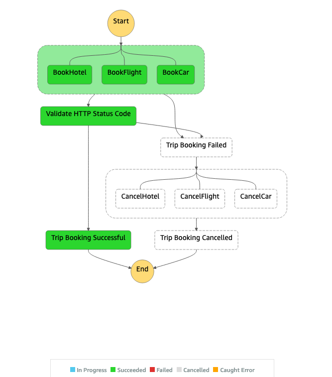
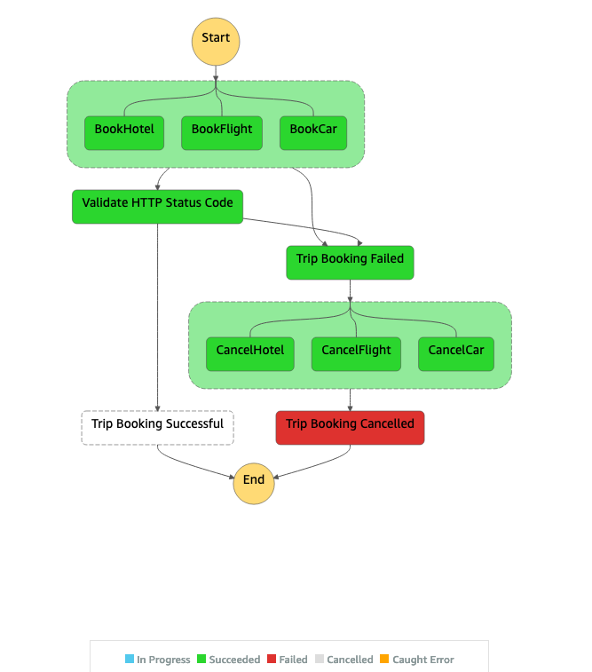

# saga-pattern-lab

## Tools

  [AWS CLI](https://aws.amazon.com/cli/)

  [AWS SAM](https://aws.amazon.com/serverless/sam/)

  [Jq](https://stedolan.github.io/jq/)

## Step Functions saga pattern

Implementation of the Saga pattern for Lambda functions using Step Functions.

Each request has a compensating request for rollback.

The Saga goes like this:

```txt
  Begin saga
    Start book hotel request
    End book hotel request
    Start book flight request
    End book flight request
    Start book car rental request
    End book car rental request  
  End saga
```

### Deployment & Test

#### Steps to deploy

Build lambda function, and prepare them for subsequent steps in the workflow
  
1. Build

    ```bash
    sam build
    ```

1. Deploy guided
  
    ```bash
    sam deploy --guided
    ```

#### Payload to test the State Machine

1. Success Test

    

    Sample JSON for Success test.

    ```json
    {
      "tripId": "5c12d94a-ee6a-40d9-889b-1d49142248b7",
      "depart": "London",
      "departAt": "2021-07-10T06:00:00.000Z",
      "arrive": "Dublin",
      "arriveAt": "2021-07-12T08:00:00.000Z",
      "hotel": "holiday inn",
      "checkIn": "2021-07-10T12:00:00.000Z",
      "checkOut": "2021-07-12T14:00:00.000Z",
      "car": "Volvo",
      "carFrom": "2021-07-10T00:00:00.000Z",
      "carTo": "2021-07-12T00:00:00.000Z"
    }
    ```

    To test this Payload, execute the follow CRUL commands to send POST request to the StateMachine via API Gateway.

    __Note:__ Make sure you have replaced the XXXXXX from <https://XXXXXXX.execute-api.us-west-2.amazonaws.com/Prod/>  with the unique id generated during your SAM deployment

    ```bash
    API_GW_URL=https://3cjw67q5hh.execute-api.us-west-2.amazonaws.com/Prod/ \
    SUCCESS_JSON_PAYLOAD='{"tripId":"5c12d94a-ee6a-40d9-889b-1d49142248b7","depart":"London","departAt":"2021-07-10T06:00:00.000Z","arrive":"Dublin",   "arriveAt":"2021-07-12T08:00:00.000Z","hotel":"holiday inn","checkIn":"2021-07-10T12:00:00.000Z","checkOut":"2021-07-12T14:00:00.000Z","car":"Volvo",  "carFrom":"2021-07-10T00:00:00.000Z","carTo":"2021-07-12T00:00:00.000Z"}' \
    executionArnPayload=$(curl -X POST -H 'Content-Type: application/json' $API_GW_URL  -d "$SUCCESS_JSON_PAYLOAD" | jq '.executionArn' )

    ```

    The commads above sends a **POST** with JSON payload to **$API_GW_URL**, then it queries the API output to filter propriety **.executionArn** and it set this propriety value to local a variable **executionArnPayload**.

    Now you check the execution status

    ```bash
    curl -X POST -H 'Content-Type: application/json' $API_GW_URL/Status -d "{ \"executionArn\": $executionArnPayload }" | jq .
    ```

    The command above sends a POST with JSON payload that content the executionArn from local variable **$executionArnPayload** and format the output using jq. The output should content the Status of the StateMachine Execution, in this case it should show **"SUCCESS"**

1. Failure test.

    

    Sample JSON for Failure test.

    ```json
    {
      "tripId": "1ecb46a4-ce47-4e13-b19e-64c2d057bed1",
      "depart": "London",
      "departAt": "2021-07-10T06:00:00.000Z",
      "arrive": "Dublin",
      "arriveAt": "2021-07-12T08:00:00.000Z",
      "hotel": "holiday inn",
      "checkIn": "2021-07-10T12:00:00.000Z",
      "checkOut": "2021-07-12T14:00:00.000Z",
      "car": "Volvo",
      "carFrom": "2021-07-10T00:00:00.000Z",
      "carTo": "2021-07-12T00:00:00.000Z",
      "failBookFlight": true
    }

    ```

    To test this Payload, execute the follow CRUL commands to send POST request to the StateMachine via API Gateway.

    ```bash
    FAILURE_JSON_PAYLOAD='{"tripId":"1ecb46a4-ce47-4e13-b19e-64c2d057bed1","depart":"London","departAt":"2021-07-10T06:00:00.000Z","arrive":"Dublin",    "arriveAt":"2021-07-12T08:00:00.000Z","hotel":"holiday inn","checkIn":"2021-07-10T12:00:00.000Z","checkOut":"2021-07-12T14:00:00.000Z", "car":"Volvo", "carFrom":"2021-07-10T00:00:00.000Z","carTo":"2021-07-12T00:00:00.000Z","failBookFlight":true}' \
    executionArnPayload=$(curl -X POST -H 'Content-Type: application/json' $API_GW_URL -d "$FAILURE_JSON_PAYLOAD"  | jq '.executionArn' )
    ```

    The commands above do the same thing as the step 1, the difference is this one sends a JSON payload that will fail, because it has **"failBookFlight": true**

    ```bash
    curl -X POST -H 'Content-Type: application/json' $API_GW_URL/Status -d "{ \"executionArn\": $executionArnPayload }" | jq .
    ```
