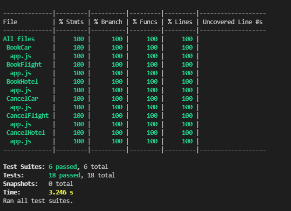
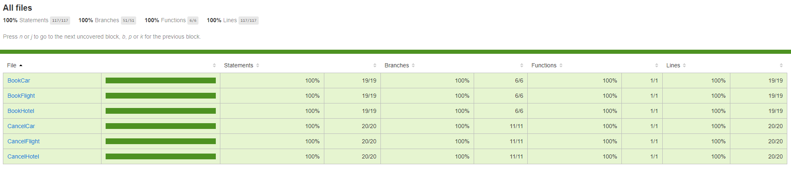
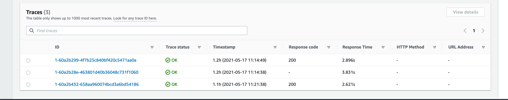
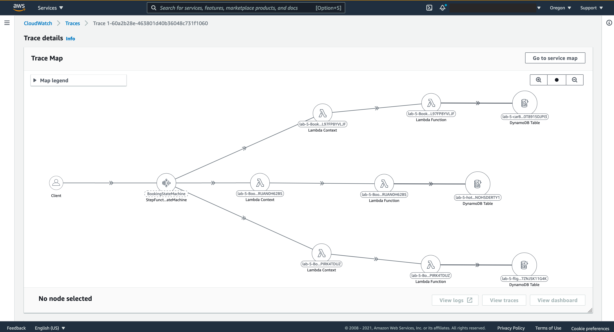
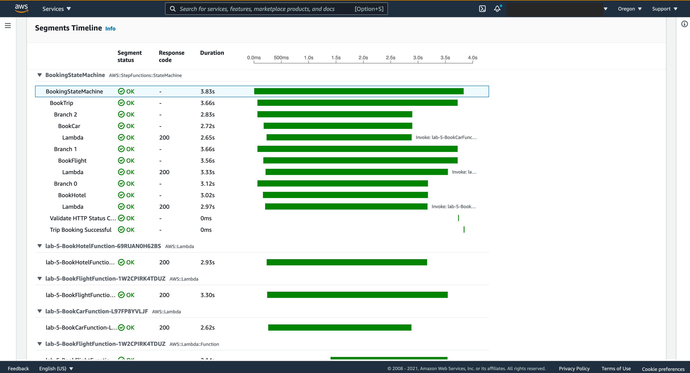
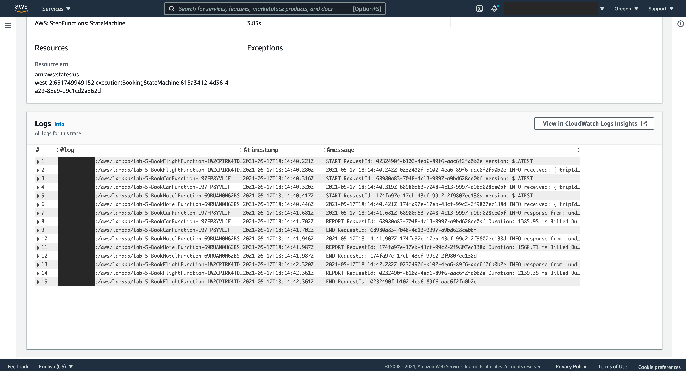

# Saga Pattern with AWS Step Functions in a SAM Project

## Summary

The Saga Pattern was published in [1987 by Hector Garcia-Molina and Kennet Salem from Princeton University](https://www.cs.princeton.edu/research/techreps/TR-070-87). It's a design pattern that helps establish data consistency in distributed applications like Microservices. It coordinates transactions between multiple Microservices to ensure that the data will remain consistent depending on the success or failure of the Business Process transaction.

This repository contains source code that shows how to Orchestrate Microservices using Saga Pattern with [AWS Step Functions](https://aws.amazon.com/step-functions). AWS Step Functions is a serverless function orchestrator that makes it easy to sequence AWS Lambda functions and multiple AWS services into business-critical applications.

## Tools

  [AWS CLI](https://aws.amazon.com/cli/)

  [AWS SAM](https://aws.amazon.com/serverless/sam/)

  [NodeJs](https://nodejs.org/)

  [Jq](https://stedolan.github.io/jq/)

## Trip Booking Saga pattern

Each request has a compensating request for rollback. The Saga goes like this:

```txt
  Begin saga
    Start book hotel request
    End book hotel request
    Start book flight request
    End book flight request
    Start book car rental request
    End book car rental request  
  End saga
```

### Deployment & Test

#### Unit test

Before you start deploying, you can run unit tests and code coverage locally to test each function.


1. Install all dependencies from sub-folders

    Run this command below to npm dependencies for each function. Note: if you're a Windows user, you can use [Git Bash](https://git-scm.com/downloads)

    ```bash
    find . -name node_modules -prune -o -name package.json -execdir npm install \;
    ```
1. Run Unit Test & Code Coverage

    This project uses [Jest](https://jestjs.io/) for Unit Test implementation

    ```bash
    npm run test
    ```
    After running this command, you should get a result like an image below: 
    

   And to explore the Code Coverage, open the file generated at **/coverage/lcov-report/index.html** in your browser, and you should see a screen like the one bellow

    

#### Steps to deploy

Build lambda function, and prepare them for subsequent steps in the workflow
  
1. Build

    ```bash
    sam build
    ```

1. Deploy guided
  
    ```bash
    sam deploy --guided
    ```

#### Payload to test the State Machine

1. Success Test

    

    Sample JSON for Success test.

    ```json
    {
      "tripId": "5c12d94a-ee6a-40d9-889b-1d49142248b7",
      "depart": "London",
      "departAt": "2021-07-10T06:00:00.000Z",
      "arrive": "Dublin",
      "arriveAt": "2021-07-12T08:00:00.000Z",
      "hotel": "holiday inn",
      "checkIn": "2021-07-10T12:00:00.000Z",
      "checkOut": "2021-07-12T14:00:00.000Z",
      "car": "Volvo",
      "carFrom": "2021-07-10T00:00:00.000Z",
      "carTo": "2021-07-12T00:00:00.000Z"
    }
    ```

    To test this Payload, execute the follow CURL commands to send POST request to the State Machine via API Gateway.

    __Note:__ Make sure you have replaced the XXXXXX from <https://XXXXXXX.execute-api.us-west-2.amazonaws.com/Prod/>  with the unique id generated during your SAM deployment

    ```bash
    DEMO_REGION=us-west-2 \
    API_GW_URL=https://XXXXXXX.execute-api.$DEMO_REGION.amazonaws.com/Prod/ \
    SUCCESS_JSON_PAYLOAD='{"tripId":"5c12d94a-ee6a-40d9-889b-1d49142248b7","depart":"London","departAt":"2021-07-10T06:00:00.000Z","arrive":"Dublin",   "arriveAt":"2021-07-12T08:00:00.000Z","hotel":"holiday inn","checkIn":"2021-07-10T12:00:00.000Z","checkOut":"2021-07-12T14:00:00.000Z","car":"Volvo",  "carFrom":"2021-07-10T00:00:00.000Z","carTo":"2021-07-12T00:00:00.000Z"}' \
    executionArnPayload=$(curl -X POST -H 'Content-Type: application/json' $API_GW_URL  -d "$SUCCESS_JSON_PAYLOAD" | jq '.executionArn' )

    ```

    The commands above sends a **POST** with JSON payload to **$API_GW_URL**, then it queries the API output to filter a proprietary **.executionArn** and it sets this proprietary value locally to a variable **executionArnPayload**.

    Now you can check the execution status

    ```bash
    curl -X POST -H 'Content-Type: application/json' $API_GW_URL/Status -d "{ \"executionArn\": $executionArnPayload }" | jq .
    ```

    The command above sends a POST with JSON payload that contains the executionArn from local variable **$executionArnPayload** and formats the output using jq. The output should contain the Status of the State Machine Execution, in this case it should show **"SUCCESS"**

1. Failure test.

    

    Sample JSON for Failure test.

    ```json
    {
      "tripId": "1ecb46a4-ce47-4e13-b19e-64c2d057bed1",
      "depart": "London",
      "departAt": "2021-07-10T06:00:00.000Z",
      "arrive": "Dublin",
      "arriveAt": "2021-07-12T08:00:00.000Z",
      "hotel": "holiday inn",
      "checkIn": "2021-07-10T12:00:00.000Z",
      "checkOut": "2021-07-12T14:00:00.000Z",
      "car": "Volvo",
      "carFrom": "2021-07-10T00:00:00.000Z",
      "carTo": "2021-07-12T00:00:00.000Z",
      "failBookFlight": true
    }

    ```

    To test this Payload, execute the follow CURL commands to send a POST request to the State Machine via API Gateway.

    ```bash
    FAILURE_JSON_PAYLOAD='{"tripId":"1ecb46a4-ce47-4e13-b19e-64c2d057bed1","depart":"London","departAt":"2021-07-10T06:00:00.000Z","arrive":"Dublin",    "arriveAt":"2021-07-12T08:00:00.000Z","hotel":"holiday inn","checkIn":"2021-07-10T12:00:00.000Z","checkOut":"2021-07-12T14:00:00.000Z", "car":"Volvo", "carFrom":"2021-07-10T00:00:00.000Z","carTo":"2021-07-12T00:00:00.000Z","failBookFlight":true}' \
    executionArnPayload=$(curl -X POST -H 'Content-Type: application/json' $API_GW_URL -d "$FAILURE_JSON_PAYLOAD"  | jq '.executionArn' )
    ```

    The commands above do the same thing as the step 1, the difference is this one sends a JSON payload that will fail, because it has **"failBookFlight": true**

    ```bash
    curl -X POST -H 'Content-Type: application/json' $API_GW_URL/Status -d "{ \"executionArn\": $executionArnPayload }" | jq .
    ```

[Click here --> https://us-west-2.console.aws.amazon.com/states/home?region=us-west-2#/statemachines](https://us-west-2.console.aws.amazon.com/states/home?region=us-west-2#/statemachines) to explore the State Machine execution from AWS Console, where you can find more details about your Stepfunction execution. Note: make sure you select the same region where you're working on, mine is **us-west-2**.

#### Observability
  
  This project implements Observability using the combination of [AWS CloudWatch](https://aws.amazon.com/cloudwatch/) and [AWS X-Ray](https://aws.amazon.com/xray/) by enabling **Tracing** to all lambda functions in [Globals Section](https://github.com/aws/serverless-application-model/blob/master/docs/globals.rst) and in the StateMachine definition from the [template.yml](template.yml). With this setting SAM will deploy the resources needed to allows X-Ray to generate an unique trace ID for each request and track its interaction with downstream calls, for more detailed instrumentations each function has implementation to instrument AWS SDK clients to wrap the aws-sdk library with the captureAWS method as the bellow code snippet, [click here to learn more about Instrumenting Node.js code in AWS Lambda](https://docs.aws.amazon.com/lambda/latest/dg/nodejs-tracing.html).

  ```js
  const AWSXRay = require("aws-xray-sdk-core");
  const AWS = AWSXRay.captureAWS(require("aws-sdk"));
  const db = new AWS.DynamoDB.DocumentClient();
  ```

  As a result of this implementation, X-Ray will collect metadata for each request and record a trace with all downstream calls, and it provide dashboard like the images bellow, where it shows all services that your request interact with, a timeline that content a precise length of all calls and a list of CloudWatch logs produced by each functions invoked by this request, this gives you a deep insight about your application in runtime and can help debug, trace, troubleshoot or monitor your workload. Here’s the link <https://us-west-2.console.aws.amazon.com/cloudwatch/home?region=us-west-2#servicelens:traces> where you can find all your requests by Trace ID, open it and scroll down you should find a list that content all your Trace IDs, click in each one to access it dashboard.

  
  
  
  

## Cleanup

To clean up the resources deployed by SAM project you can use AWS CloudFormation passing your SAM project name correspondent with stack-name from CloudFormation

  ```bash
    aws cloudformation delete-stack --stack-name demo-saga-pattern-stepfunctions
  ```


## Security

See [CONTRIBUTING](CONTRIBUTING.md#security-issue-notifications) for more information.

## License

This library is licensed under the MIT-0 License. See the LICENSE file.

